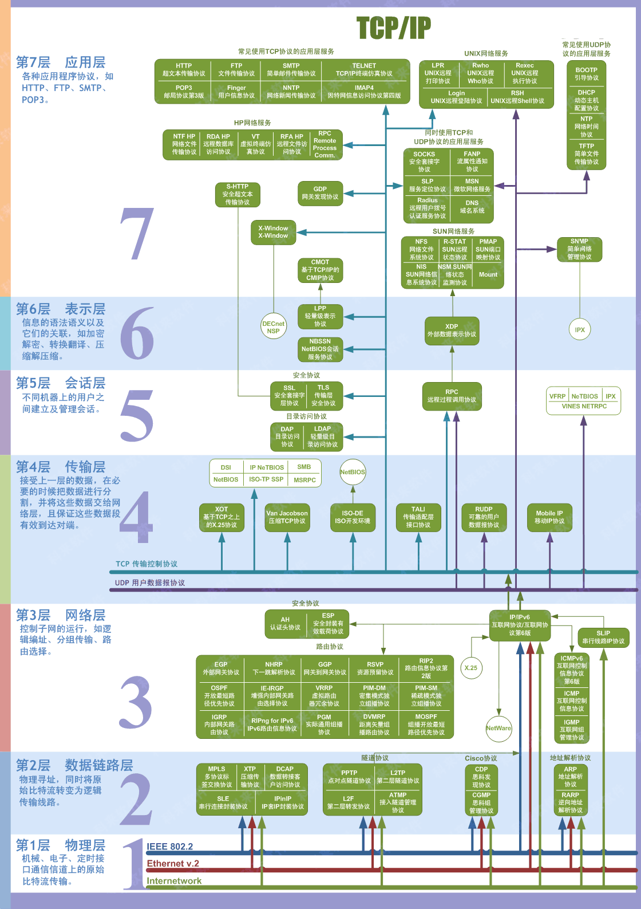

# PC Quick

## Web

> 计算机网络核心就是**协议**的学习

- **Purpose**
  
  同一个设备之间可以通过文件管理系统操作外存内的文件，但当人们想要把不同设备的信息联系、通讯或操作时，就需要一个其他的方法——网络便应运而生了。

  网络应该怎么设计才能使设备相连呢？从一个设备发送出发吧：首先是把要发送的文件打包成数据。。。

### 协议概览

<!--  -->

### IP地址（IPv4）

- 地址和号
  - 什么什么号就是划分的那一部分
  - 地址就是用掩码与运算的结果

- **2级划分**
  - 网络号
  - 主机号
  - 划分标准
    - ABCDEF

- **子网划分**
  - 网络地址：IP地址 $\oplus$ 子网掩码
  - 主机地址：IP地址 $\oplus\ \lnot$ 子网掩码
  
- **E.g.**
  4个字节 `119.23.51.144`，也就是 `01110111.00010111.00110011.10010000`。\
  子网掩码为 `255.255.255.240` 即 `11111111.11111111.11111111.11110000`
  
  网络号就是 IP 和 **原子网掩码**做与运算，即 `119.23.51.0`
  主机号就是 ``
